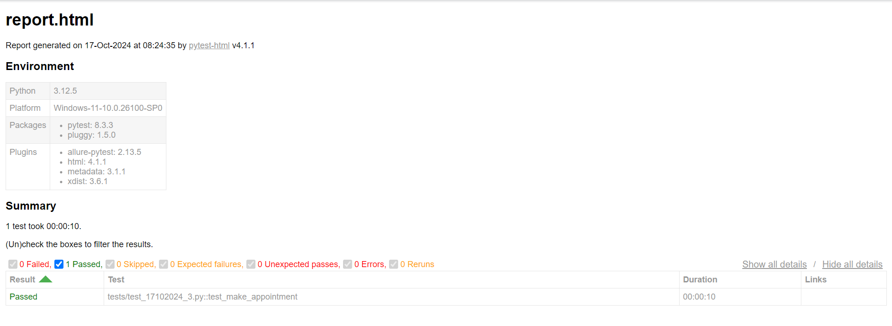

## Selenium Automation Practice

## HTML Reporting - 


## Command to run the test - 
```aiignore
pytest
```

## Command to run a specific test file - 
```aiignore
pytest tests\test_17102024_3.py
```